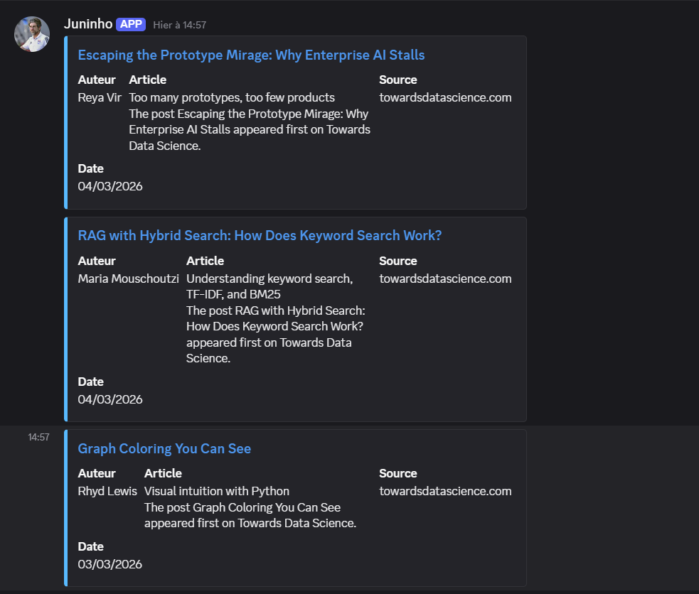
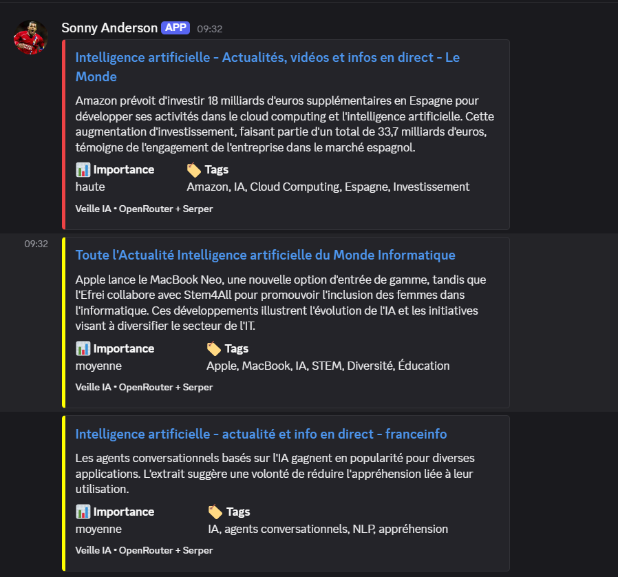
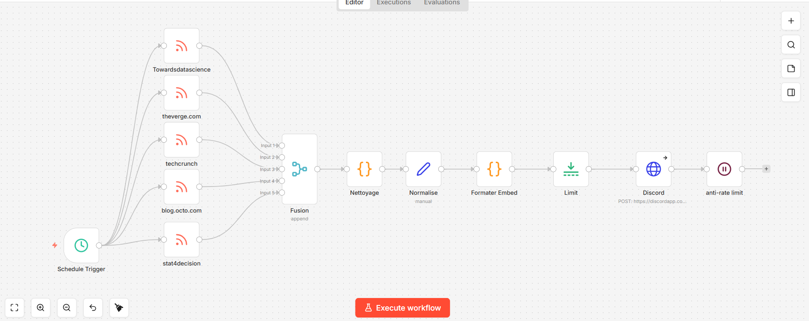
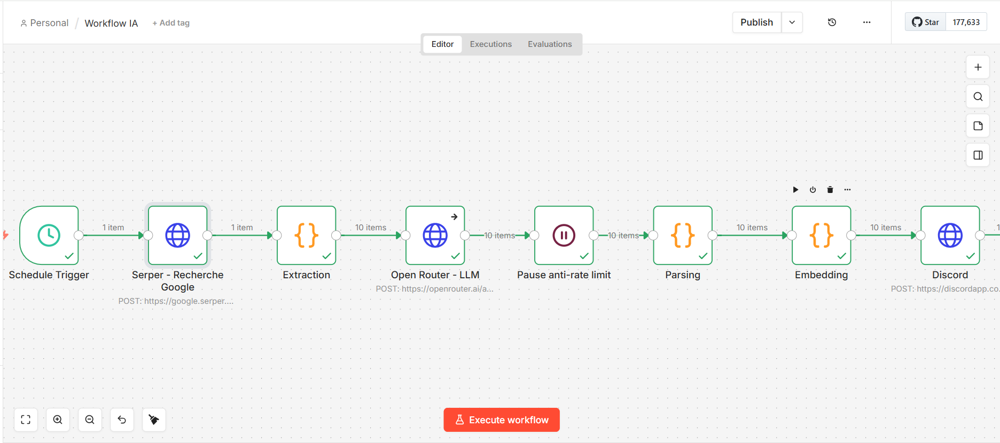

# 🤖 Veille IA Automatisée avec N8N

Workflow de veille technologique automatisé sur l'Intelligence Artificielle, utilisant N8N, Serper, OpenRouter et Discord.

---

## 📋 Contenu du repo

```
Inititation_N8N/
├── docker-compose.yml        # Lancer N8N en local
├── workflows/
│   ├── workflow_rss.json     # Workflow RSS N8N
│   └── workflow_llm.json     # Workflow LLM N8N
└── README.md
```

---

## 🚀 Lancer N8N en local

### Prérequis
- [Docker Desktop](https://www.docker.com/products/docker-desktop/) installé et lancé

### Démarrage

```bash
docker compose up
```

N8N sera accessible sur **http://localhost:5678**


## 🔄 Workflows

### Workflow RSS — Collecte des articles
Récupère les 10 derniers articles sur l'IA via l'API Serper (Google Search) et extrait titre, lien et extrait de chaque résultat.

### Workflow LLM — Analyse et envoi Discord
Pour chaque article collecté :
1. Envoie le titre + extrait au LLM (OpenRouter / Gemma 3)
2. Le LLM génère un résumé, un niveau d'importance et des tags
3. Formate et envoie un embed coloré sur Discord

| Importance | Couleur |
|---|---|
| 🔴 Haute | Rouge |
| 🟡 Moyenne | Jaune |
| 🟢 Faible | Vert |

---

## 📸 Résultat sur Discord






---

## 🖼️ Aperçu du workflow

### Workflow RSS


### Workflow LLM


## 🛠️ Stack technique

| Outil | Usage |
|---|---|
| [N8N](https://n8n.io) | Orchestration du workflow |
| [Serper](https://serper.dev) | Recherche Google via API |
| [OpenRouter](https://openrouter.ai) | Accès LLM (Gemma 3 free) |
| [Discord](https://discord.com) | Destination des alertes |
| [Docker](https://docker.com) | Environnement local N8N |
